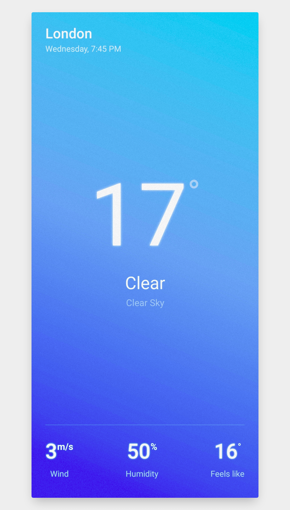

# Weather App

A beautiful and simple weather app build with React Native, written in TypeScript and using [OpenWeather](https://openweathermap.org/) API

## 🚀 Demo

[Live demo](https://expo.dev/@deigo/weather-app)

## 📦 Installation

Clone the repo locally:

```sh
git clone https://github.com/smartcrash/weather-app
cd weather-app
```

Install NPM dependencies:

```sh
npm install
```

Run the dev server

```sh
npm start
```
